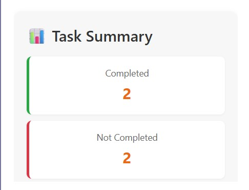
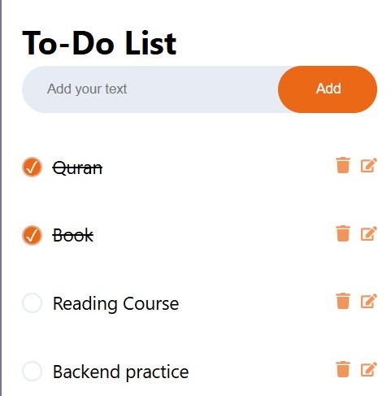

# 📝 React To-Do App

A modern, responsive, and fully interactive To-Do list application built with **React**. This app allows users to add, edit, delete, and mark tasks as complete. All data is saved in **localStorage**, so your tasks persist even after a page refresh.

---

## 🚀 Live Demo

👉 [Live App](https://abdukadir037.github.io/react-todo-app)

---

## ✨ Features

- ✅ Add new tasks
- ✏️ Edit existing tasks
- ❌ Delete tasks
- ✔️ Toggle task completion
- 💾 Saves to `localStorage`
- 🔘 Custom checkbox styling with icons
- 📊 Task summary: total, completed, not completed, all/any complete
- 🖥 Responsive UI for mobile & desktop

---

## 📦 Folder Structure

```
react-todo-app/
├── public/
│   └── index.html
├── src/
│   ├── components/
│   │   ├── TodoForm.js
│   │   └── TodoList.js
│   ├── App.js
│   ├── App.css
│   └── index.js
├── README.md
└── ...
```

---

## 🛠 Installation & Setup

1. **Clone the repository**

```bash
git clone https://github.com/abdukadir037/react-todo-app.git
cd react-todo-app
```

2. **Install dependencies**

```bash
npm install
```

3. **Start the development server**

```bash
npm start
```

Then open `http://localhost:3000` to view the app in your browser.

---

## 🌐 Deployment (GitHub Pages)

1. Install the GitHub Pages package:

```bash
npm install --save gh-pages
```

2. Add this to your `package.json`:

```json
"homepage": "https://abdukadir037.github.io/react-todo-app",
"scripts": {
  "predeploy": "npm run build",
  "deploy": "gh-pages -d build"
}
```

3. Deploy it:

```bash
npm run deploy
```

---

## 🧠 Technologies Used

- React
- React Icons
- JavaScript (ES6+)
- CSS3
- LocalStorage API

---

## 📸 Screenshots

### 📋 Task Summary UI



### 🧾 To-Do List Interface




## 📄 License

This project is open-source and free to use.


## 🙋 Author

Made with ❤️ by **Abdukadir Hilowle**  
GitHub: [@abdukadir037](https://github.com/abdukadir037)


> If you like this project, please star the repo and share it!
